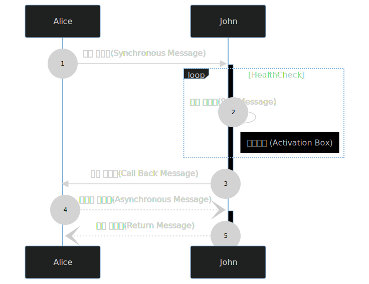

[Mermaid Live Editor](https://mermaid-js.github.io/mermaid-live-editor/edit#pako:eNpt0M2qAjEMBeBXidk68wJdKILC1a3bbkJ7dMrtj9YWEfHd7YzjzqwC-U4gebJJFqz4hmtFNNg6OWcJOlKrjXcG_Wq1PKQhKvqD94nGvqMh3Uky6JHq-if-MCNxJDRAMgXMdJz1jfZTpi12n3RH-ykx6RZb_OZ7OgGezhlSZvIt7jggB3G23fQcZ5rLgADNqrVW8r9mHV_N1YuVgp11JWVWJ_E3dCy1pOMjGlYlV3zR_JRZvd5_C2Gl)

- 활성객체: 런타임에 생성되는 객체는 네모로 표현한다.
- 메세지: 하나의 객체에서 다른 객체로 통신하는 행위. 선과 화살표로 표현한다.
  - 동기 메세지: 순서가 중요한 작업의 처리를 위해서 요청한 메세지에 대한 응답을 기다린다.
  - 비동기 메세지: 순서가 중요하지 않은 작업이기에 응답을 요구하지 않는 메세지.
  - 자체 메세지: 스스로에게 보낸 메세지
  - 반환 메세지: 반환을 요청한 객체에게 돌려보내는 응답 메세지
  - 활성 박스: 객체에 컴퓨터 자원이 할당되어서 대기나 작업을 하는 상태

    
    
```
sequenceDiagram
    autonumber
    activate John
    Alice->>+John: 동기 메세지(Synchronous Message)
    loop HealthCheck
        John->>John: 자체 메세지(Self Message)
        Note right of John : 활성박스 (Activation Box)
    end
        John->>+Alice: 콜백 메세지(Call Back Message)
    deactivate John
    Alice--)+John: 비동기 메세지(Asynchronous Message)
    John--)-Alice: 반환 메세지(Return Message)
```

