[Mermaid Live Editor](https://mermaid-js.github.io/mermaid-live-editor/edit#pako:eNptkU1PwzAMhv9K5BOI9Q9EXBDbJA477YYqITcxndV8QD40weh_Jy1rGR0-OY_tV2_sEyivCSQogzGuGduAtnaixINji0bcf1WVWGfVXdMtx8M1faYm4B8sxR27JLClJd6nwK4VLTlN4bI4jMQd2pLe3C4KFhNNcLQ92jv9ADGLNoTdozc-zIV4ZDsNlud7RtVN7_5Sb_jYrFcN3iN_0pPbEqUZK3QbTP_Ojyv4NdR4bwTHlyMbPcOQ3WJ2CliBpWCRdbnLqFJDOpClGmRJNYauhtr1pS-_6bKMjebkA8hXNJFWgDn5_YdTIFPINDWdb3vu6r8BaWOZRQ)

- 클래스: 클래스 멤버들을 포함하고 있는 데이터 타입
- 클래스 멤버: 속성과 메소드와 같은 클래스의 구성원
- 리턴 타입: 메소드가 반환하는 데이터 타입
- 제너릭 타입: 필드, 파라미터, 리턴에 데이터 타입을 런타임 시의 추론으로 결정하는 데이터 타입
- 가시성, 접근성: 자바에서 public, private, protected, package/internal로 결정되는 클래스 멤버에 대한 접근 가능 정도

예제

```
classDiagram
    Animal <|-- Duck
    Animal <|-- Fish
    Animal <|-- Zebra
    Animal : +int age
    Animal : +String gender
    Animal: +isMammal()
    Animal: +mate()
    class Duck{
      +String beakColor
      +swim()
      +quack()
    }
    class Fish{
      -int sizeInFeet
      -canEat()
    }
    class Zebra{
      +bool is_wild
      +run()
    }
            
```

