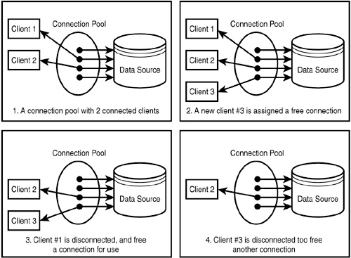

 Pool은 특정 인스턴스의 생성비용을 피하기 위해서 미리 인스턴스를 만들어 놓고 관리하는 것을 의미한다.

예를 들어서 Thread는 Process보다 생성비용이 적지만 많은 Thread를 매번 생성하는 것은 비용이 크다.

이런 컴퓨터 자원을 더 효율적으로 이용하기 위해서 Spring 프레임워크에서는 Thread Pool을 지원한다.

 
 데이터베이스의 사용에서 가장 비용이 큰 부분은 DB와의 커넥션을 여는 부분이다.

그림으로는 다음과 같다.



 DB를 이용하기 위해서는 대략 5가지의 과정이 필요하다.

1. JDBC 드라이버 로드
2. DB Connection 객체 생성
3. PreparedStatement 객체 생성
4. executeQuery()의 리턴 값인 ResultSet 객체 생성
5. 리소스들의 반환

이 부분에서 가장 많이 비용이 발생하는 곳은 2번인 DB Connection 객체 생성이다.

이 비용을 줄이기 위해서 쓰이는 것이 DB 커넥션풀이고 대표적으로는 Apache의 Tomcat dbcp가 있다.

DBCP를 이용한 구현의 예제는 다음과 같다.

```
package com.dan.practice.demos.myapp;

import org.apache.tomcat.dbcp.dbcp.BasicDataSource;
import org.springframework.context.annotation.Bean;
import org.springframework.context.annotation.ComponentScan;
import org.springframework.context.annotation.Configuration;
import org.springframework.jdbc.core.JdbcTemplate;
import org.springframework.jdbc.datasource.DriverManagerDataSource;
import org.springframework.jdbc.datasource.SingleConnectionDataSource;

import javax.sql.DataSource;

@Configuration
@ComponentScan("com.dan.practice.demos.myapp")
public class AppConfig {

    @Bean
    public DataSource dataSource() {
        //Reusage of the same connection for the ease of test. Someone should close the connection via the close() method
//        SingleConnectionDataSource dataSource = new SingleConnectionDataSource();


        //This is Apache tomcat dbcp(database connetion pool)
        BasicDataSource dataSource = new BasicDataSource();
        dataSource.setDriverClassName("org.h2.Driver");
        //dataSource.setUrl("jdbc:h2:mem:mydb"); //h2 memory db
        dataSource.setUrl("jdbc:h2:file:~/ModernJava/mydb;AUTO_SERVER=TRUE;DB_CLOSE_ON_EXIT=FALSE");
        dataSource.setUsername("sa");
        dataSource.setPassword("");
        //dataSource.setMaxActive(5);  //Methods from BasicDataSource
        //dataSource.setMaxIdle(30000);
        return dataSource;
    }
}
```
dataSoucre 메소드에 주석처리된 setMaxActive와 setMaxIdle이 있다.

MaxActive는 최대로 활성화 할 수 있는 커넥션의 수

MaxIdle는 최대로 유지될 수 있는 커넥션의 수 이다.

이 값들은 WAS(Web Applcation Server)에서 운용하는 Thread의 수와 조합을 해주어야하는데

좀 더 자세한 사항은 다음 포스트에서 찾아볼 수 있다.

<a>https://www.holaxprogramming.com/2013/01/10/devops-how-to-manage-dbcp/</a>


출처 :
<a>https://www.holaxprogramming.com/2013/01/10/devops-how-to-manage-dbcp/ </a>

<a>https://ejbvn.wordpress.com/category/week-2-entity-beans-and-message-driven-beans/day-09-using-jdbc-to-connect-to-a-database/ </a>

