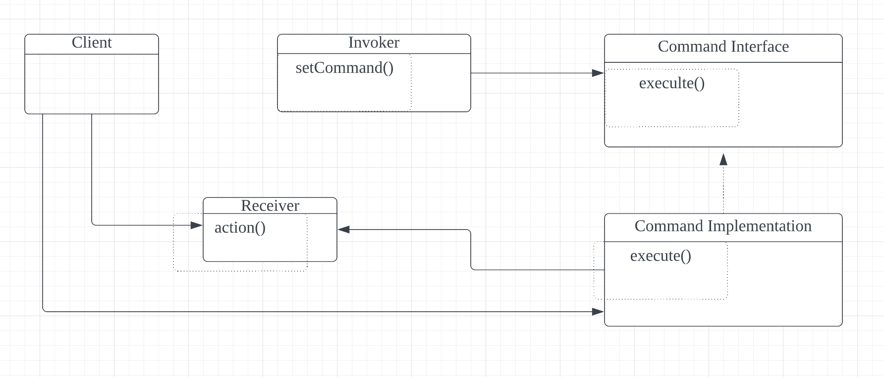

 커맨드 패턴은 메소드 호출(기능)을 캡슐화하는 디자인 패턴이다.

이로 인해 객체는 캡슐화된 메소드의 연산을 신경쓰지 않아도 된다.

객체의 메소드 기능의 수가 많고 미래에 추가적으로 예측하기 힘든 메소드가 들어올 경우에 유용한 패턴이다.

핵심은 지시의 요청자와 실행자를 분리하는 것 이다.

전등을 키는 커맨드 예제

```java
public class LightOnCommand implements Commaned {
    Light light;
    
    public LightOnCommand(Light light) {
        this.light = light;
    }
    
    public void execute() {
        light.on();
    }
}
```

커맨드 객체 예제

```java
public class SimpleRemoteControl {
    Command slot;
    public SimpleRemoteControl() {}
    
    public void setCommand(Command command) {
        slot = command;
    }
    
    public void buttonWasPressed() {
        slot.execute();
    }
}
```

```java
public class RemoteControlTest {
    public static void main(String[] args) {
        SimpleRempoteControl remote = new SimpleRemoteControl();
        Light light = new Light();
        LightOnCommand lightOn = new LightOnCommand(light);
        
        remote.setCommand(lightOn);
        remote.buttonWasPressed();
    }
}
```

예제 코드에서는 커맨드 패턴이 요청을 객체로 캡슐화 시켜서 파라미터에 객체를 넣을 수 있도록 합니다.

