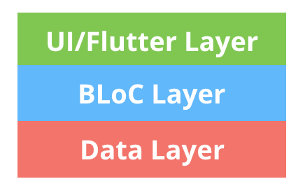
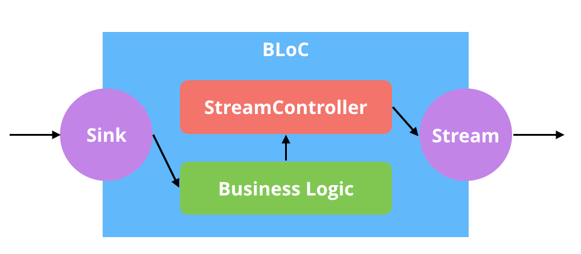

 플러터의 상태관리를 위해서 쓰이는 디자인 패턴이 BLoC이다.

BLoC는 Reactive Style과 굉장히 유사하다.

BLoC의 핵심은 앱 안에 있는 모든 것들이 이벤트 스트림으로 표현되어야 한다는 것이다.

플러터는 iOS나 안드로이드 앱 개발에서 쓰이는 MVC 패턴가는 다르게

UI - BLoC - Data로 이루어져있다.



MVC는 Controller가 Model과 View를 왔다갔다 할 수 있는 반면에

플러터는 철저하게 UI는 BLoC에 BLoC은 Data에게만 접근할 수 있다.


플러터의 BLoC 형태:

 각 UI들은 BLoC객체를 구독하고 있다.
 
 BLoC객체의 상태가 변경되면, BLoC의 상태를 구독하는 다른 UI객체도 해당 상태로 UI를 변경시키다.
 
```dart
class BLoC {
    provider: Provider = new Provider();
    stream: Subject = new Subject();
    async sink() {
        const data = await Provider.getCounterModel();
        const result = await this.BussinessLogic(data);
        this.stream.next(result);
    }
    private async BussinessLogic() {
    }
}
```


```dart
class UI {
    bloc = new BLoC();
    constructor() {
        this.bloc.stream.subscribe((data) => {
            this.render(data);
        });
    }
    render(data) {
        return (
            <div onClick={this.bloc.sink}>
                {data}
            </div>
        )
    }
}
```



특징
 - UI와 BLoC는 다대다 관계이다.
 - UI는 화면만을 담당하고 BLoC에서는 로직만을 담당한다.
 - BLoC(비즈니스 로직)만 따로 테스트를 할 수 있다.

