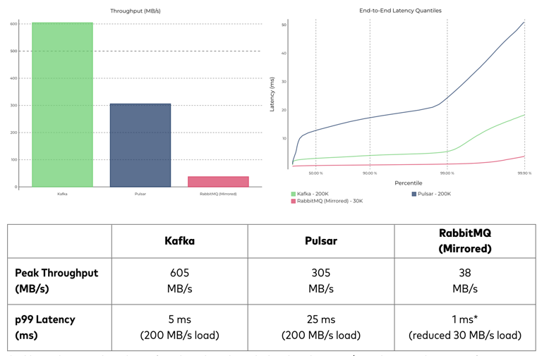

Kafka
 - definition : A data streaming platform that combine messages, data-storage, data-integration, and stream processing.
 - Kafka provides high throughput, high availability, low latency

Fig1- Kafka performance benchmark

What systems are Kafka works the best.
  - MSA and IoT System

Kafka main capabilities:
 - Reading and writing records like a message queue
 - Storing records with fault tolerance
 - Processing streams as they occur

Kafka Client Types

 - producer
   - sends multiple data streams to the Kafka brokers
 - broker
   - serve a similar function as the receiver
 - consumer
   - read data from the brokers and process it

Kafka deliverty methods
  - At-least-once semantics
  - At-most-once semantics
  - Exactly-once semantics

Why Kafka
  - Capability of serving volumes of data for multiple business units
  - Immediate data analysis for the live in-bounding data (fast data, high-availability)
  - Horizontal scalability
  - Replay messages by default
  - Parallel processing of data

When is not to use Kafka
  - When you need batch works or schedules.
  - When you don't need high tolerance, availability, or throughput
  - When you don't have time to implement Kafka and keep the system simpler.
  - When your team is not ready for real-time data processing systems such as MSA and IoT System.