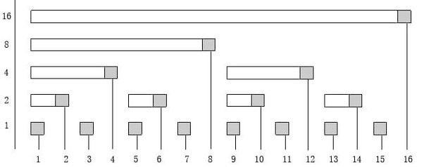

https://leetcode.com/problems/range-sum-query-mutable/

동적으로 변경되는 일정한 길이의 합을 질의(query)하는 전형적인 다이나믹 레인지 합 쿼리 문제이다.

펜윅트리(Fenwick Tree) 또는 바이너리 인덱스드 트리(Binary Indexed Tree)나 세그먼트 트리(Segment Tree)를 이용하여서 푸는 문제이다.

바이너리 인덱스드 트리는 펜윅트리의 또다른 이름이다.

이 두 알고리즘은 일반적으로 기업 코딩 테스트에서 안나오는 문제이다. 굉장히 특정한 문제에서만 쓰일 수 있는 자료구조라서 그렇다.

백준 같은 경우 플래티넘에 들어가는 수문장 역할을 하는 알고리즘들이다.

일단 펜윅트리를 알아보자.

펜윅트리의 amoritized 성능

|        | Algorithm | Worst Case |
|--------|-----------|------------|
| Space  | O(n)      | O(n)       |
| Search | O(logn)   | O(logn)    |
| Insert | O(logn)   | O(logn)    |
| Delete | O(n)      | O(n)       |

정적 배열을 이용한 amoritized 성능

|        | Algorithm | Worst Case |
|--------|-----------|------------|
| Space  | O(n)      | O(n)       |
| Search | O(n)      | O(n)       |
| Insert | O(1)      | O(1)       |
| Delete | O(1)      | O(1)       |

펜윅트리는 세그먼트 트리에 비해서 구현이 조금 더 쉽다.

펜윅트리를 구현하기 위해서는 어떤 수 X를 이진수로 나타냈을 때 마지막에 있는 1의 위치를 알아내야합니다.

예)
  - 3 = 11
  - 4 = 100
  - 5 = 101
마지막에 오는 1의 위치를 L[num]라고 표현한다면

3인 경우 L[3] = 1, 4인 경우 L[4] = 3, 5인 경우 L[5] = 1이 됩니다.

이를 그래프로 표현하면 다음과 같다.



L[i] = i & -i가 된다.

일반적으로 펜위트리는 정적 배열을 이용하여서 구현을 한다.

펜윅트리를 (BIT)라고도 하는데 여기서 부터는 BIT로 표기하도록 하겠다.

BIT는 인덱스를 1번부터 사용한다. 0번은 더미노드로 사용하지 않는다.

이는 비트연산을 할 때 더미노드가 필요하기 때문이다.

BIT의 구현 방법은 다음과 같다.

 1. BIT의 배열을 전부 0으로 초기화 시킨다.
 2. update() 함수를 호출한다. (BIT의 배열에 arr[idx] += val 처럼 합을 넣어준다.)
 3. getSum() 함수를 호출한다. (0번 인덱스 부터 지정된 인덱스 까지의 합을 반환한다.)

BIT의 C++ 기본 구현은 다음과 같다.

```c++
class FenwickTree {
private:
    vector<int> data;

    int getParent(int i) const {
        return i - (i & (-i));
    }

    int getNext(int i) const {
        return i + (i & (-i));
    }

public:
    FenwickTree(int n) : data(n+1, 0) {
    }

    int getSum(int i) const {
        int sum = 0;
        ++i;
        while (i > 0) {
            sum += data[i];
            i = getParent(i);
        }
        return sum;
    }

    void update(int i, int v) {
        ++i;
        while (i < data.size()) {
            data[i] += v;
            i = getNext(i);
        }
    }
};
```


이를 해당 문제에 적용하면 다음과 같다.

```c++
class BIT { // One-based indexing
    vector<int> bit;
public:
    BIT(int size=0) {
        bit.assign(size + 1, 0);
    }
    int getSum(int idx) { // Get sum in range [1..idx]
        int sum = 0;
        for (; idx > 0; idx -= idx & (-idx))
            sum += bit[idx];
        return sum;
    }
    void addValue(int idx, int val) {
        for (; idx < bit.size(); idx += idx & (-idx))
            bit[idx] += val;
    }
};
class NumArray {
    BIT bit;
    vector<int> nums;
public:
    NumArray(vector<int>& nums) {
        this->bit = BIT(nums.size());
        this->nums = nums;
        for (int i = 0; i < nums.size(); ++i)
            bit.addValue(i+1, nums[i]);
    }
    void update(int index, int val) {
        int diff = val - nums[index]; // get diff amount of `val` compared to current value
        bit.addValue(index + 1, diff); // add this `diff` amount at index `index+1` of BIT, plus 1 because in BIT it's 1-based indexing
        nums[index] = val; // update latest value of `nums[index]`
    }
    int sumRange(int left, int right) {
        return bit.getSum(right+1) - bit.getSum(left);
    }
};
```