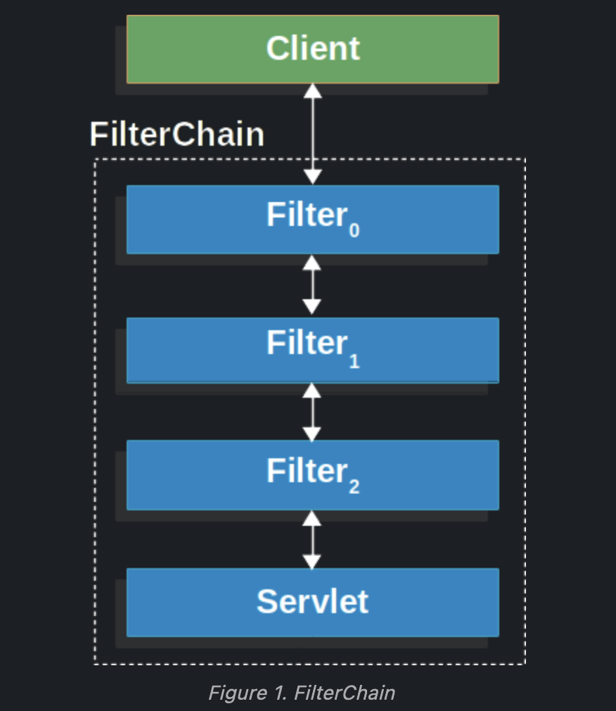
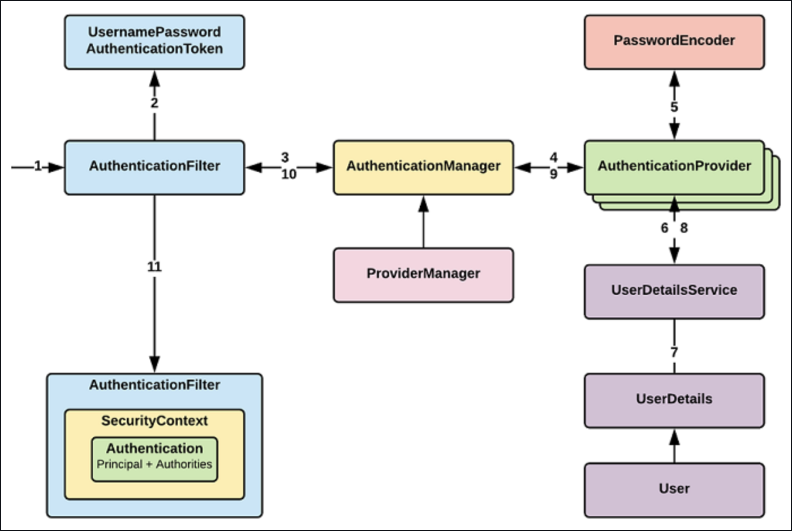

접근 주체(Principle) 리소스 접근자
인증(Authentication): 접근자에 대한 확인 작업
인가(Authority): 접근자의 권한 확인 작업

스프링 시큐리티는 자바 어플케이션에게 일반적인 공격들에 대한보안을 지원합니다.

인증과 인가에 대한 요구사항을 커스터마이징을 지원합니다.

위의 그림은 일반적인 HTTP Request에 대한 핸들러의 레이어를 보여줍니다.

좀 더 세부적으로 보여주는 아키텍쳐 구조는 다음과 같다.

1. AuthenticaionFilter가 HttpRequest를 받고 확인(validation)을 해준다.
2. 1번에서 유효성 검증 후 UsernamePasswordAuthenticationToken이 토큰 생성
3. AuthenticationManager가 실제 인증을 처리하는 AuthenticationProvider(ProviderManager)에게 전달한다.
4. ProviderManager는 DaoAutenticationProvider.authenticate()를 호출한다.

